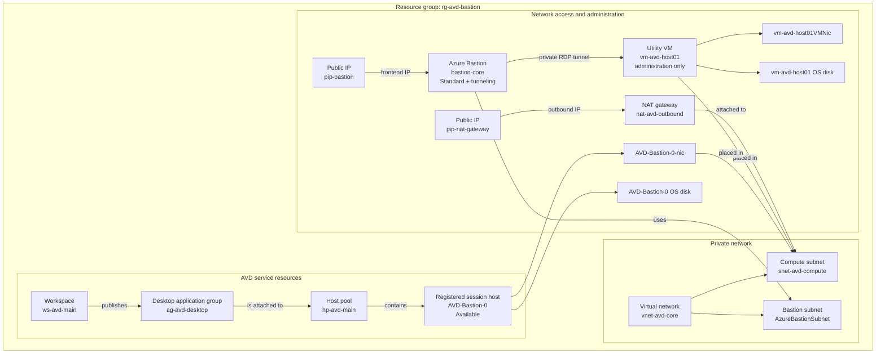
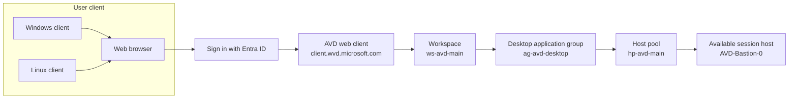
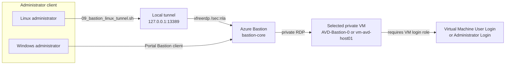

# Azure Virtual Desktop deployment

## Plan

This repository builds a private Azure Virtual Desktop environment in five stages:

1. Prepare Azure CLI on Linux and select the correct tenant and subscription.
2. Create the network, Bastion, host-pool control plane, NAT, and identity permissions.
3. Create or verify a registered AVD session host.
4. Verify access and connect through the AVD web client or Bastion administration path.
5. Clean up the Azure resource group when the environment is no longer required.

The repository is deliberately split into small scripts. The orchestration script
[00_run_avd_setup.sh](./00_run_avd_setup.sh) runs the scripted stages and pauses with
the exact instructions when the supported session-host creation step is required.

## Quick start

From this directory, run the one orchestration script:

```bash
bash 00_run_avd_setup.sh ./avd_config.env
```

It calls the lower-level deployment scripts in the correct order. If Azure Portal
session-host creation is needed, it pauses and prints the instructions. After the
session host is created and reports **Available**, resume it with:

```bash
bash 00_run_avd_setup.sh ./avd_config.env --continue
```

Then connect through the [AVD web client](https://client.wvd.microsoft.com/arm/webclient)
and open workspace `ws-avd-main`.

The cleanup script is intentionally separate because it deletes the complete Azure
environment:

```bash
bash 08_cleanup_azure.sh ./avd_config.env --delete
```

## Current environment

Last checked: 20 September 2026.

```text
Tenant:              stored in private.env
Subscription:         stored in private.env
Region:               Australia East
Resource group:       rg-avd-bastion
VNet:                 vnet-avd-core (10.0.0.0/16)
Compute subnet:       snet-avd-compute (10.0.0.0/24)
Bastion subnet:       AzureBastionSubnet (10.0.1.0/26)
Host pool:            hp-avd-main
Application group:    ag-avd-desktop
Workspace:            ws-avd-main
```

The control plane, network, Bastion, NAT gateway, and user permissions are deployed.
The Portal-created host `AVD-Bastion-0` is registered on the private compute subnet and is currently
`Available` with `AllowNewSession=True`.

## AVD session-host configuration

The following settings document the session host created through the Azure Portal
**Add virtual machines to a host pool** workflow. They describe `AVD-Bastion-0`, not
the separate script-created utility VM `vm-avd-host01`.

| Setting | Value |
|---|---|
| Resource group | `rg-avd-bastion` |
| Host-pool name | `hp-avd-main` |
| Session-host name prefix | `AVD-Bastion` |
| Session-host VM name | `AVD-Bastion-0` |
| Virtual machine type | Azure virtual machine |
| Region | Australia East (`australiaeast`) |
| Availability option | Availability zones |
| Availability zone | Zone 1 |
| Security type | Trusted launch virtual machines |
| Secure Boot | Enabled |
| vTPM | Enabled |
| Integrity monitoring | Disabled |
| Image publisher | `MicrosoftWindowsDesktop` |
| Image offer | `windows-11` |
| Image SKU | `win11-25h2-avd` |
| Image version | `latest` at deployment; deployed exact version `26200.9457.260913` |
| Operating system | Windows 11 Enterprise multi-session, Version 25H2 |
| VM size | `Standard_D2as_v5` |
| VM resources | 2 vCPUs, 8 GiB memory |
| Number of VMs | 1 |
| OS disk type | Standard SSD (`StandardSSD_LRS`) |
| OS disk size | 128 GiB |
| OS disk caching | ReadWrite |
| Boot diagnostics | Enabled with managed storage account |
| Virtual network | `vnet-avd-core` |
| Subnet | `snet-avd-compute` (`10.0.0.0/24`) |
| Network security group | Basic |
| Public inbound ports | None |
| Directory join | Microsoft Entra ID |
| Intune enrollment | No |
| AVD registration | Registered in `hp-avd-main` |
| Current state | `Available`; `AllowNewSession=True` |

The session-host local administrator username used in the Portal workflow is
`local-admin`. The administrator password is deliberately not documented or stored
in the repository. The separate script-created utility VM uses the username
`local-admin-2026` from [avd_config.env](./avd_config.env).
The exact generated NIC, disk, and managed-identity resource IDs are also omitted because
Azure generates them and they are not needed to repeat the Portal setup.

## Azure resources and how they fit together

The deployment has two different kinds of resources:

* **AVD service resources** publish the desktop and select a session host.
* **Network and compute resources** provide the private network, outbound access, and
  administration path for the session host.

The important distinction is that `AVD-Bastion-0` is the registered AVD session host
created from the Azure Portal workflow. `vm-avd-host01` is a separate utility VM created
by the scripts. The utility VM is not part of the host pool and is not used for normal
AVD user sessions.



Normal AVD sessions use the AVD service connection from the workspace to the registered
session host. Bastion is a separate private administration path; it is not the normal
AVD user-session path. The session host and utility VM have no public IP address.

### Resource inventory

The table lists the resources expected in `rg-avd-bastion`. Some resources are supporting
resources automatically created for a VM or service rather than resources named directly
in a script.

| Resource | Azure type | Why it exists | Created or configured by |
|---|---|---|---|
| `rg-avd-bastion` | Resource group | Boundary containing the complete deployment and cleanup scope | [01_deploy_network.sh](./01_deploy_network.sh); removed by [08_cleanup_azure.sh](./08_cleanup_azure.sh) |
| `vnet-avd-core` | Virtual network | Private address space for Bastion, session hosts, and administration VMs | [01_deploy_network.sh](./01_deploy_network.sh) |
| `snet-avd-compute` | Subnet | Private placement for session hosts and `vm-avd-host01` | [01_deploy_network.sh](./01_deploy_network.sh) |
| `AzureBastionSubnet` | Subnet | Dedicated subnet required by Azure Bastion | [01_deploy_network.sh](./01_deploy_network.sh) |
| `pip-bastion` | Standard static public IP | Public frontend used by Azure Bastion | [01_deploy_network.sh](./01_deploy_network.sh) |
| `bastion-core` | Azure Bastion | Securely reaches private VMs without giving them public IPs | [01_deploy_network.sh](./01_deploy_network.sh); tunneling enabled by [07_enable_bastion_native_client.sh](./07_enable_bastion_native_client.sh) |
| `pip-nat-gateway` | Standard static public IP | Stable source IP for outbound traffic from the compute subnet | [03_assign_permissions.sh](./03_assign_permissions.sh) |
| `nat-avd-outbound` | NAT gateway | Provides outbound Internet access for private compute resources | [03_assign_permissions.sh](./03_assign_permissions.sh) |
| `hp-avd-main` | AVD host pool | Defines the collection and session-allocation behavior for AVD hosts | [02_deploy_avd_compute.sh](./02_deploy_avd_compute.sh) |
| `ag-avd-desktop` | AVD desktop application group | Publishes the desktop resource to entitled users | [02_deploy_avd_compute.sh](./02_deploy_avd_compute.sh) |
| `ws-avd-main` | AVD workspace | User-facing container that displays the published desktop | [02_deploy_avd_compute.sh](./02_deploy_avd_compute.sh) |
| `AVD-Bastion-0` | Virtual machine / AVD session host | Runs the user desktop and is registered in `hp-avd-main` | Azure Portal session-host workflow; instructions are printed by [00_run_avd_setup.sh](./00_run_avd_setup.sh) |
| `AVD-Bastion-0-nic` | Network interface | Gives the registered session host private connectivity | Automatically created with `AVD-Bastion-0` by the Portal workflow |
| `AVD-Bastion-0` OS disk | Managed disk | Stores the registered session host operating system | Automatically created with `AVD-Bastion-0` by the Portal workflow |
| `vm-avd-host01` | Virtual machine | Optional utility VM for private administration and troubleshooting | [02_deploy_avd_compute.sh](./02_deploy_avd_compute.sh) |
| `vm-avd-host01VMNic` | Network interface | Gives the utility VM private connectivity | Automatically created by [02_deploy_avd_compute.sh](./02_deploy_avd_compute.sh) |
| `vm-avd-host01` OS disk | Managed disk | Stores the utility VM operating system | Automatically created by [02_deploy_avd_compute.sh](./02_deploy_avd_compute.sh) |
| `AADLoginForWindows` | VM extension | Enables Microsoft Entra sign-in support on the utility VM | [02_deploy_avd_compute.sh](./02_deploy_avd_compute.sh) |
| `Virtual Machine Administrator Login` | Azure RBAC assignment | Allows the signed-in administrator to sign in to a VM through RDP | [03_assign_permissions.sh](./03_assign_permissions.sh) |
| `Desktop Virtualization User` | Azure RBAC assignment | Allows the signed-in user to launch the published AVD desktop | [05_assign_avd_user_access.sh](./05_assign_avd_user_access.sh) |

The exact generated NIC and disk names can include Azure-generated suffixes. They are
owned by their parent VM and are deleted with the resource group or VM.

## User connection flow

Normal users do not connect to Bastion. They open the AVD web client from either Windows
or Linux, authenticate with the account assigned to the application group, and launch the
desktop published in `ws-avd-main`.



The user needs the `Desktop Virtualization User` role on `ag-avd-desktop`. The session
host must report `Available` and `AllowNewSession=True`.

## Administrator connection flow through Bastion

This is a separate flow for VM administration. From Linux, the tunnel script creates a
local listener and FreeRDP connects to that listener. From Windows, the Azure Portal
Bastion browser client can be used instead.



The Bastion path is for administration and troubleshooting. It does not replace the
AVD web-client path for normal desktop users.

## Files and responsibilities

| File | Purpose |
|---|---|
| [avd_config.env](./avd_config.env) | Shared names and deployment settings |
| [01_deploy_network.sh](./01_deploy_network.sh) | Resource group, VNet, subnets, Bastion, and Bastion public IP |
| [02_deploy_avd_compute.sh](./02_deploy_avd_compute.sh) | Host pool, application group, workspace, and utility VM |
| [03_assign_permissions.sh](./03_assign_permissions.sh) | NAT gateway, subnet association, and VM administrator role |
| [04_verify_avd_state.sh](./04_verify_avd_state.sh) | Control-plane, session-host, VM, and role checks |
| [05_assign_avd_user_access.sh](./05_assign_avd_user_access.sh) | Desktop Virtualization User role on the application group |
| [06_remove_unused_vm.sh](./06_remove_unused_vm.sh) | Dry-run and confirmed removal of the utility VM |
| [07_enable_bastion_native_client.sh](./07_enable_bastion_native_client.sh) | Enables Azure CLI Bastion tunneling |
| [08_cleanup_azure.sh](./08_cleanup_azure.sh) | Deletes and verifies the entire project resource group |
| [00_run_avd_setup.sh](./00_run_avd_setup.sh) | Runs the setup, pauses for session-host creation, then resumes |

There is one Phase 3 script. NAT and permissions are intentionally combined in
[03_assign_permissions.sh](./03_assign_permissions.sh). The old manual agent-download
script is not part of the supported workflow.

## 1. Linux prerequisites

Install Azure CLI and sign in:

```bash
az version
az extension add --name bastion
cp private.env.example private.env
# Edit private.env and replace the placeholder values.
chmod 600 private.env
source ./private.env
az login --tenant "$TENANT_ID"
az account set --subscription "$SUBSCRIPTION_ID"
```

`private.env` contains tenant and subscription values. It is ignored
by Git and must not be committed. The tracked [private.env.example](./private.env.example)
contains placeholders only. The deployment scripts load `private.env` through
[avd_config.env](./avd_config.env). Generic private network ranges remain in the
tracked configuration because they are RFC1918 documentation values, not credentials.

For Bastion RDP from Linux, install an RDP client if needed:

```bash
command -v xfreerdp || command -v xfreerdp3 || command -v remmina
sudo apt-get update
sudo apt-get install -y freerdp2-x11
```

## 2. Recommended end-to-end run

Run the orchestration script:

```bash
bash 00_run_avd_setup.sh ./avd_config.env
```

The scripts are safe to rerun. Existing-resource checks leave the VNet, Bastion, host
pool, application group, workspace, and VMs in place rather than recreating them.

It runs:

```text
01 network
02 AVD control plane and utility VM
03 NAT and VM administrator permissions
08 Bastion native tunneling
06 AVD desktop-user entitlement
```

When no usable session host exists, the script pauses. It prints the manual Portal
instructions, then exits without pretending the deployment is complete.

### Manual step shown by the pause

In Azure Portal:

1. Open **Host pools** and select `hp-avd-main`.
2. Open **Session hosts** and select **Add**.
3. Set the name prefix to `AVD-Bastion`.
4. Choose **Azure virtual machine** in **Australia East**.
5. Select **Availability zones** and **Zone 1**.
6. Select **Trusted launch virtual machines**.
7. Confirm **Secure Boot** and **vTPM** are enabled; leave **Integrity monitoring** disabled.
8. Select **Windows 11 Enterprise multi-session, Version 25H2** (`win11-25h2-avd`).
9. Select size **Standard D2as v5** (2 vCPUs, 8 GiB memory).
10. Set **Number of VMs** to `1`.
11. Select **Standard SSD** and the default OS disk size of **128 GiB**.
12. Enable boot diagnostics with a managed storage account.
13. Select VNet `vnet-avd-core`.
14. Select subnet `snet-avd-compute`.
15. Use the **Basic** network security group option.
16. Set public inbound ports to **No**.
17. Select **Microsoft Entra ID** for the join type.
18. Set **Enroll VM with Intune** to **No**.
19. Do not select `AzureBastionSubnet`.
20. Complete the administrator settings and create the host.
21. Wait until the host reports **Available** and accepts new sessions.

Resume from Linux:

```bash
bash 00_run_avd_setup.sh ./avd_config.env --continue
```

The resume mode waits for an `Available` host with `AllowNewSession=True`, then runs
the final verification and prints the web-client URL.

## 3. Normal AVD connection from Linux

Open the [AVD web client](https://client.wvd.microsoft.com/arm/webclient) in a browser.

1. Sign in with the user assigned to `ag-avd-desktop`.
2. Open workspace `ws-avd-main`.
3. Launch the desktop.
4. Confirm the session host is Available.

The required user role is:

```text
Desktop Virtualization User
```

Check or assign it with:

```bash
bash 05_assign_avd_user_access.sh ./avd_config.env
```

## 4. Administration through Bastion from Linux

The Bastion resource must be Standard or Premium and have native tunneling enabled.
The setup scripts configure Standard Bastion with tunneling enabled.

Check it:

```bash
az network bastion show \
  --resource-group rg-avd-bastion \
  --name bastion-core \
  --query '{sku:sku.name,enableTunneling:enableTunneling,state:provisioningState}' \
  --output table
```

If required:

```bash
bash 07_enable_bastion_native_client.sh ./avd_config.env
```

The direct `az network bastion rdp` command is not suitable on this Linux installation.
The installed Bastion extension imports the Windows-only Python symbol `WinDLL` and fails
before it starts RDP. Use the native tunnel instead; this separates Azure/Bastion
authentication from the local Linux RDP client.

Start a tunnel to the active session host:

```bash
bash 09_bastion_linux_tunnel.sh ./avd_config.env AVD-Bastion-0 13389
```

Leave that command running. In a second terminal, connect your RDP client to:

```text
127.0.0.1:13389
```

The tunnel command must remain running while FreeRDP is connected. If the tunnel
terminal is closed, or if it exits, port `13389` is no longer usable and FreeRDP can
report `Broken pipe`. Check it before starting FreeRDP:

```bash
ss -ltn '( sport = :13389 )'
```

The output must contain a `LISTEN` entry for `127.0.0.1:13389`.

For example, with FreeRDP:

```bash
xfreerdp \
  /v:127.0.0.1:13389 \
  /u:'AzureAD\your-user@your-domain' \
  /sec:nla \
  /cert:ignore \
  /network:auto
```

Use the Entra ID password when FreeRDP prompts. The `/sec:nla` option is required by
the Windows host; TLS-only mode can cause a broken-pipe or protocol-negotiation error.
The account still needs `Virtual Machine Administrator Login` or `Virtual Machine User
Login` on the target VM. The AVD desktop-user role is separate.

If the account uses MFA or passwordless authentication, FreeRDP may not be able to
complete the Entra interactive sign-in. In that case use the Portal Bastion browser
client for administration, or use the AVD web client for the normal desktop session.

## 5. Verify the environment

```bash
bash 04_verify_avd_state.sh ./avd_config.env
```

A ready session host must show:

```text
Status: Available
AllowNewSession: True
```

The script also checks the host pool, application group, workspace, VM ownership, public
IP state, application-group role assignments, and session-host health-check results. If
the status is `Unavailable`, read the health-check messages before attempting a user
connection.

## 6. Clean up everything

The resource group is the cleanup boundary. Deleting it removes the VNet, Bastion, public
IPs, NAT gateway, host pool, application group, workspace, VMs, NICs, disks, extensions,
and session hosts. It does not remove local files or unregister the Azure provider.

Preview:

```bash
bash 08_cleanup_azure.sh ./avd_config.env
```

Delete after checking the displayed subscription and resource list:

```bash
bash 08_cleanup_azure.sh ./avd_config.env --delete
```

The script requires typing `rg-avd-bastion`, waits for Azure deletion, and verifies that
the resource group no longer exists.

## 7. Non-interactive checks

To check the current environment without creating or changing resources:

```bash
bash 00_run_avd_setup.sh ./avd_config.env --check-only
```

The installed Azure CLI exposes host-pool, application-group, and workspace commands, but
not the supported Portal-equivalent session-host creation workflow. Therefore the runner
automates every supported CLI stage and pauses for the Portal session-host operation when
needed. Once a host already exists and is healthy, `--continue` completes without another
manual step.

## Security note

[avd_config.env](./avd_config.env) does not contain an administrator password. When
[02_deploy_avd_compute.sh](./02_deploy_avd_compute.sh) needs to create `vm-avd-host01`,
it prompts twice for the password without echoing it. The value is held only in memory
for the `az vm create` operation and is then unset.

When the VM already exists, no password is requested. Do not put the password on a command
line, in a shell export, or in a file. The local administrator password is separate from
the Entra ID password used for AVD and Entra authentication.
